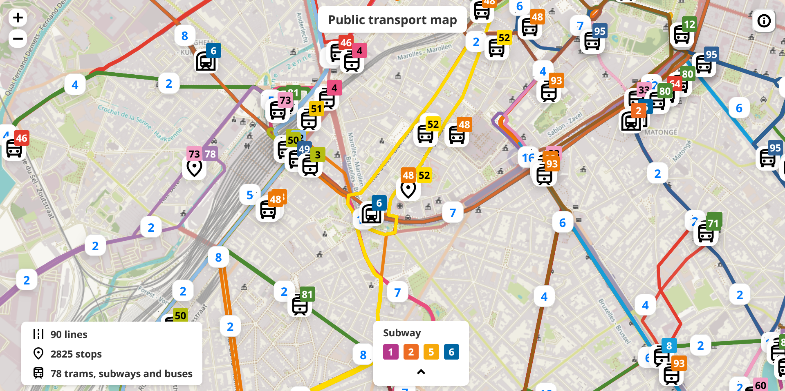

# Public Transport Map



This project provides a comprehensive map for public transport, built using React with TypeScript. The application leverages Leaflet for interactive map features and integrates various datasets, including information from the STIB (Société des Transports Intercommunaux de Bruxelles), to display routes, stops, and real-time vehicle positions. All data is sourced from the STIB Open Data portal: [STIB Open Data Portal](https://data.stib-mivb.be/pages/home/).


## Project Setup

### Framework and Tools

- **Framework:** React
- **Language:** TypeScript
- **Build Tool:** Vite
- **Transpiler:** SWC

## Installation

1. **Clone the Repository**:
   ```bash
   git clone https://github.com/your-repo/public-transport-map.git
   cd public-transport-map
   ```

2. **Install Dependencies**:
   ```bash
   npm i
   ```

3. **Start the Development Server**:
   ```bash
   npm run dev
   ```

## Documentation

Refer to the following documentation for detailed information on the tools and libraries used in this project:

- [React Reference Overview](https://react.dev/reference/react)

## Project Structure

- **src/**: Contains the source code for the project.
  - **components/**: Reusable React components.
  - **assets/**: Images, icons, and other static assets.
  - **types/**: TypeScript type definitions.
  - **styles/**: CSS and SCSS files for styling.

## Features

- **Interactive Map**: Uses Leaflet for displaying a dynamic, interactive map.
- **Real-time Data**: Displays real-time positions of public transport vehicles.
- **Custom Markers**: Custom icons for different types of transport.
- **Routes and Stops**: Visualizes routes and stops with detailed information.

### Icons and Fonts

Use Google Fonts for typography and ensure the project follows a consistent design language. Access Google Fonts here:
[Google Fonts](https://fonts.google.com/)

### Contribution

Contributions are welcome! Please follow the guidelines below:

1. Fork the repository.
2. Create a new branch for your feature or bugfix.
3. Commit your changes and push the branch to your fork.
4. Open a pull request to the main repository.

## License

This project is licensed under the MIT License.
